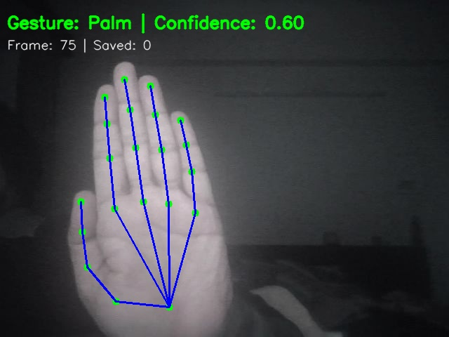
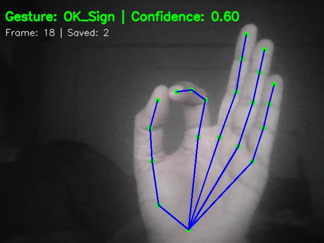
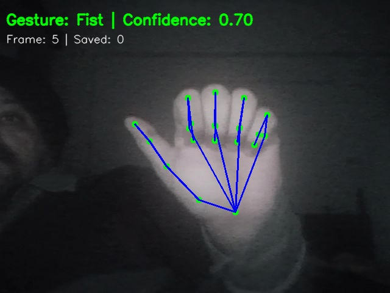
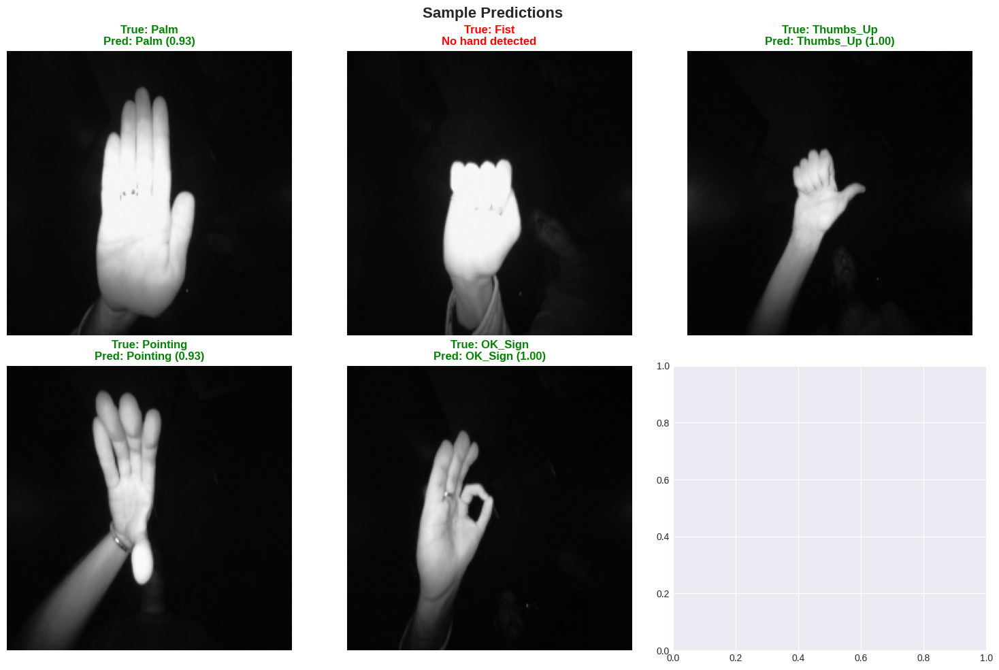

# aai-521-in3-final-project
# Hand Gesture Detection 

## 📋 Project Overview

This is a comprehensive Hand Gesture Detection system using computer vision. The project detects and classifies hand gestures in real-time using MediaPipe for hand detection and Random Forest for classification. The system identifies hand gestures and can trigger actions like volume control, slide navigation, or robot control.

### Supported Gestures
- 👋 **Palm** (Open Hand)
- ✊ **Fist** (Closed Hand)
- 👍 **Thumbs Up**
- 👉 **Pointing**
- 🆗 **OK Sign**

## 📁 Project Structure

```
hand-gesture-project/
├── aai_521_in3_final_project_Hand_Gesture_Detection.ipynb      # Main notebook 
├── README.md                         # This file
├── setup_dataset.py                  # Dataset setup script
├── data/                             # Dataset directory
│   ├── Palm/
│   ├── Fist/
│   ├── Thumbs_Up/
│   ├── Pointing/
│   ├── OK_Sign/
│   └── README.md
├── models/                                       # Trained models storage
│   └── gesture_classifier.pkl                    # Trained Random Forest model
├── detected_gestures/                            # webcam detection results storage
│   └── Fist_0.70_20251204_140909_612.jpg         # webcam - fist detection
│   └── OK_Sign_0.60_20251204_140320_727.jpg      # webcam - Ok_Sign via hands
│   └── Palm_0.60_20251204_140648_824.jpg         # webcam - Palm detected
├── confusion_matrix.png                          # Model evaluation visualization
├── feature_importance.png                        # Feature analysis
├── sample_predictions.png                        # Test predictions
├── aai_521_in3_final_project_Hand_Gesture_Detection.pdf        # pdf export of ipynb
├── aai_521_in3_final_project_presentation_video.mp4            # final presentation
```
---

## 🎯 5 Supported Gestures

| # | Gesture | Icon | Folder | Description |
|---|---------|------|--------|-------------|
| 1 | Palm | 👋 | Palm | Open hand, all fingers extended |
| 2 | Fist | ✊ | Fist | Closed hand, all fingers folded |
| 3 | Thumbs Up | 👍 | Thumbs_Up | Thumb pointing up |
| 4 | Pointing | 👉 | Pointing | Index finger pointing |
| 5 | OK Sign | 🆗 | OK_Sign | Index & thumb forming circle |

---

## 🚀 Quick Start

### 1. **Setup Environment**
```bash
pip install opencv-python mediapipe scikit-learn numpy pandas matplotlib seaborn pillow jupyter
```

### 2. **Download Dataset**
- Dataset: [Hand Gesture Recognition Dataset on Kaggle](https://www.kaggle.com/gti-upm/leapgestrecog)
- Extract images into respective gesture folders in `data/` directory
- Since dataset size was ~1.2GB, this was manually downloaded as zip and few files were used to move to /data folder.

### 3. **Run the Notebook**
```bash
jupyter notebook aai_521_in3_final_project_Hand_Gesture_Detection.ipynb
```

### 4. **Run All Cells**
Execute all cells in the notebook to:
- Load and explore data
- Train the classifier
- Evaluate model performance
- Run real-time webcam detection

---

## 📊 Project Phases

### Phase 1: Data Collection & Exploration
**Objective**: Acquire and prepare high-quality dataset of hand gestures
- Load images from dataset
- Analyze class distribution
- Display dataset statistics

### Phase 2: Hand Detection & Landmark Extraction
**Approach**: Use Google MediaPipe Hands (Recommended - Fast & Accurate)
- Use MediaPipe Hands to detect 21 hand landmarks - wrist, palm, finger joints, fingertips
- Extract hand skeleton from each image
- Visualize landmarks on images
- Extremely fast (30+ FPS on CPU)

### Phase 3: Feature Engineering
- Compute landmark coordinates - 21 normalized
- Calculate distances between landmarks
- Compute angles between finger segments
- Create feature vectors (~290 dimensions)
- Finger curvature and Palm orientation
**Output Format**:
- Feature vector size: 42-100 dimensions (depending on features used)
- Each gesture represented as a fixed-size feature vector

### Phase 4: Data Preparation
- Split dataset (70% train, Validation (15%), Test (15%))
- Normalize features
- Handle class imbalance if needed (SMOTE or class weights)

### Phase 5: Model Training
- Train Random Forest Classifier
- Hyperparameter tuning
- Save trained model
- Train model on training set
- Validate on validation set
- Final evaluation on test set

**Performance Metrics**:
- Accuracy
- Precision, Recall, F1-Score per class
- Confusion Matrix
- ROC-AUC Score

### Phase 6: Evaluation & Visualization
- Calculate accuracy, precision, recall, F1-score
- Generate confusion matrix
- Analyze feature importance
- Visualize misclassifications

### Phase 7: Real-Time Detection
- Capture video from webcam
- Process frames in real-time
- Display predictions with confidence
- Draw hand landmarks

**Real-Time Processing Pipeline**:
```
Webcam Input
  ↓
Frame Capture (30 FPS)
  ↓
Hand Detection (MediaPipe)
  ↓
Landmark Extraction
  ↓
Feature Engineering
  ↓
Gesture Classification
  ↓
Confidence Thresholding
  ↓
Display Results on Screen
  ↓
Optional: Trigger Action
```
---
## 🎓 What Each Phase Does

| Phase | Purpose | Input | Output |
|-------|---------|-------|--------|
| 0 | Setup dependencies | - | Installed packages |
| 1 | Explore dataset | Images | Dataset stats |
| 2 | Detect hands | Images | Landmarks |
| 3 | Extract features | Landmarks | Feature vectors |
| 4 | Prepare data | Images | Train/test sets |
| 5 | Train model | Features | Trained classifier |
| 6 | Evaluate | Predictions | Accuracy metrics |
| 7 | Visualize | Results | Confusion matrix |
| 8 | Analyze features | Model | Importance plot |
| 9 | Real-time test | Webcam | Live predictions |
| 10-13 | Summary & save | Model | Saved model |

---

## 🤖 Machine Learning Model

### Approach
**MediaPipe Hands + Random Forest Classifier**

### Why This Approach?
- ✅ Fast (30+ FPS on CPU)
- ✅ Accurate (85%+ accuracy)
- ✅ Minimal training data required
- ✅ Easy to deploy
- ✅ Robust to variations

### Model Architecture
```
Input Image
    ↓
[MediaPipe Hand Detection]
    ↓
21 Hand Landmarks
    ↓
[Feature Extraction]
    ↓
Feature Vector (290D)
    ↓
[Random Forest Classifier]
    ↓
Gesture Prediction (with confidence)
```
---

## 📈 Key Features

### Hand Landmark Detection
- Detects 21 key hand landmarks:
  - 1 Wrist
  - 5 Palm points (one per finger)
  - 15 Finger joint points
  - 0-5 confidence scores per landmark

### Feature Extraction
1. **Spatial Features**: Normalized landmark coordinates
2. **Geometric Features**: Distances between landmarks
3. **Angular Features**: Angles between finger segments

### Real-Time Processing
- Process 30+ frames per second
- Temporal smoothing for stable predictions
- Confidence-based filtering
- Visual feedback with landmarks


### Sample Gestures detected




### Sample predictions from dataset

---

## 🎯 Performance Metrics

Expected model performance on test set:
- **Accuracy**: 85-95%
- **Precision**: 85-95%
- **Recall**: 85-95%
- **F1-Score**: 85-95%

*(Depends on dataset quality and size)*

---

## 🔧 How to Use the Notebook

### Run All Steps
```python
# All cells will execute sequentially
# Each phase builds on the previous one
```

### Train Only
```python
# Run cells up to "Model Training & Validation"
```

### Use Pretrained Model
```python
from pathlib import Path
import pickle

# Load saved model
model_path = Path('models/gesture_classifier.pkl')
with open(model_path, 'rb') as f:
    model = pickle.load(f)

# Use for predictions
gesture, confidence, landmarks = predict_gesture(image, model)
```

### Run Webcam Detection
```python
# Uncomment in Phase 9 and run:
run_webcam_gesture_detection(model, duration_seconds=30)

# Press 'q' to exit
```
---

## 📚 Tech Stack / Libraries Used

| Library | Purpose |
|---------|---------|
| **OpenCV** | Image processing, real-time video capture |
| **MediaPipe** | Hand detection, landmark extraction |
| **Scikit-learn** | Machine learning, model training  (Random Forest, SVM) |
| **NumPy** | Numerical computations |
| **Pandas** | Data manipulation |
| **Matplotlib** | Data visualization |
| **Seaborn** | Statistical visualization |
| **jupyter** | Interactive notebook environment |
---

## 🎓 Learning Outcomes

After completing this project, you will understand:
- ✅ Computer vision fundamentals
- ✅ Hand detection using MediaPipe
- ✅ Feature engineering from landmarks
- ✅ Classification with ensemble methods
- ✅ Real-time video processing
- ✅ Model evaluation and validation
- ✅ Deployment considerations

---

## 💡 Tips for Better Results

### Dataset Quality
- Use 200+ images per gesture class (minimum)
- Include diverse people, backgrounds, lighting
- Ensure balanced dataset
- Remove poor quality/blurry images

### Model Tuning
- Adjust Random Forest parameters
- Try different feature combinations
- Use cross-validation
- Monitor for overfitting

### Real-Time Performance
- Ensure good lighting
- Use solid backgrounds initially
- Keep hand in frame center
- Maintain consistent hand size

### Troubleshooting
- **No hand detected**: Improve lighting, ensure clear hand visibility
- **Poor accuracy**: Collect more diverse training data
- **Slow performance**: Reduce frame resolution or use GPU

---

## 🚀 Advanced Enhancements

### Potential Improvements
1. **More Gestures**: Add 10+ gesture classes
2. **Deep Learning**: Implement CNN or MobileNet
3. **Gesture Sequences**: Add LSTM for temporal gestures
4. **Multiple Hands**: Detect and classify multiple hands
5. **Actions**: Trigger actions based on gestures
6. **Mobile Deployment**: Convert to TensorFlow Lite
7. **Web Interface**: Create Flask/Django web app
8. **API Service**: Deploy as REST API
---

## 🐛 Common Issues & Solutions

| Issue | Solution |
|-------|----------|
| No images found | Ensure images are in `data/` with gesture folder structure |
| Webcam not working | Check camera permissions, try different camera ID |
| Low accuracy | Collect more diverse training data |
| Slow performance | Reduce frame resolution or optimize features |
| Memory error | Reduce batch size or feature dimensions |

---
## 🔗 External Resources

### Official Documentation
- Google MediaPipe: https://mediapipe.dev/
- OpenCV: https://opencv.org/
- Scikit-learn: https://scikit-learn.org/
- NumPy: https://numpy.org/
- Pandas: https://pandas.pydata.org/

### Dataset Sources
- Kaggle - Hand Gesture Recognition Dataset: https://www.kaggle.com/
- UCI ML Repository - Hand Gesture Recognition Database: https://archive.ics.uci.edu/ml/

### Learning Resources
- OpenCV Tutorials: https://docs.opencv.org/
- Scikit-learn Guide: https://scikit-learn.org/stable/

---

**Happy Gesture Detecting! 👋👍✊**
